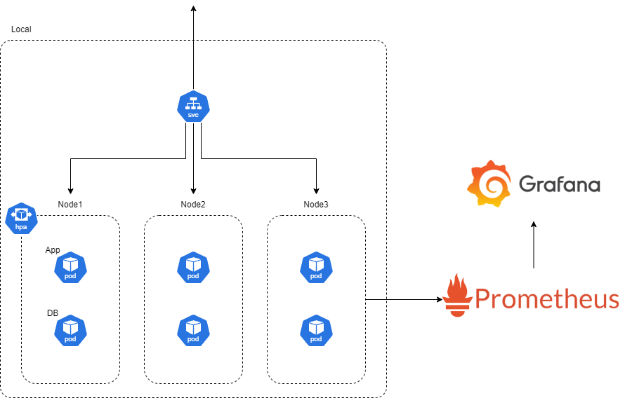

# Monitoring Project

## The Objective

- Locust로 부하테스트 실시
- HPA와 VPA를 사용하여 스케줄링
- Grafana로 시각화 및 분석

### Environment

- Google Kubernetes Engine
- Google Cloud SQL
- Spring Boot:3.4.2
- Kubernetes:1.31.0
- Database
  - Local: MySQL
  - Test: PostgreSQL

### Monitoring

- Prometheus
- Grafana
- Locust

### CI/CD

- GitHub Webhook
- Jenkins
- ArgoCD
- Docker
- Ansible

## The Process
|Order|✅|
|:-----|:----:|
|1. App 서버 개발|✅|
|2. ArgoCD 설치 및 서버 배포||
|3. 모니터링 시스템 구축||
|4. Locust 설치 및 테스트||
|5. HPA와 VPA 구성||
|6. 테스트 변수 바꾸며 분석||
|7. Karpenter와 GKE 자동 스케줄링 비교||