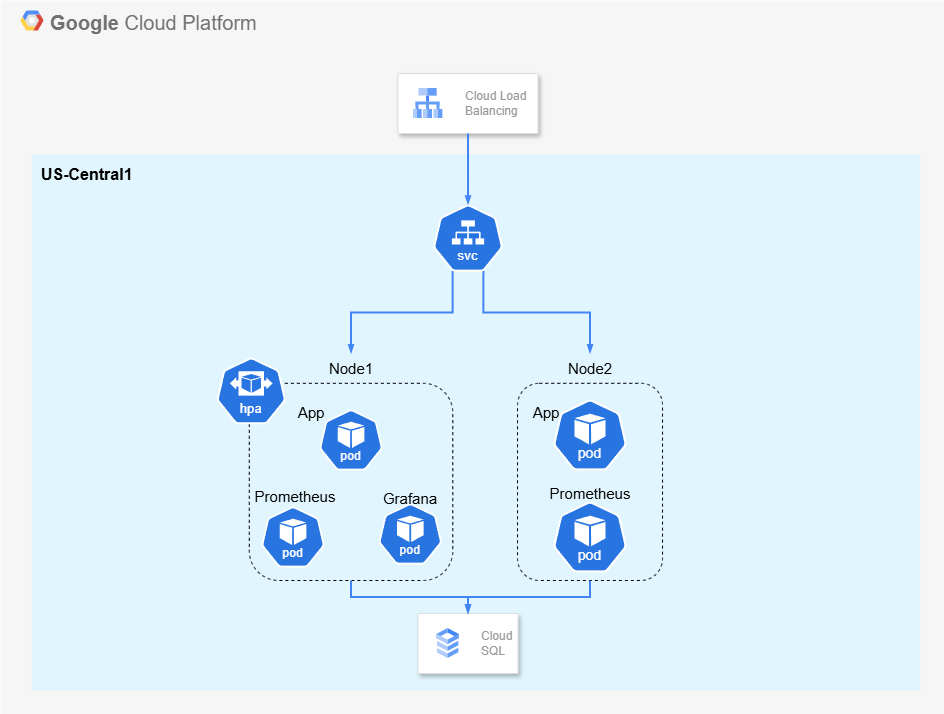

# Monitoring Project

## The Objective

- Test using Locust
- Scheduling using HPA
- Visualization and analysis with Grafana
- More than 100 rps

### Environment

- Google Kubernetes Engine
- Google Cloud SQL
- Spring Boot:3.4.2
- Kubernetes:1.31.0
- Database
  - Local: MySQL
  - Test: PostgreSQL
- Kafka

### Monitoring

- Prometheus
- Grafana

### CI/CD

- GitHub Action
- Jenkins
- ArgoCD
- Docker
- Ansible

## The Process
|Order|✅|
|:-----|:----:|
|1. Develop App-server|✅|
|2. Install ArgoCD and Deploy server|✅|
|3. Set Prometheus&Grafana|✅|
|4. Install Locust and Test|✅|
|5. Configure HPA|✅|
|6. Analysis with changing variables||
|7. Configure Kafka||
|8. Retest and Compared with prior results||