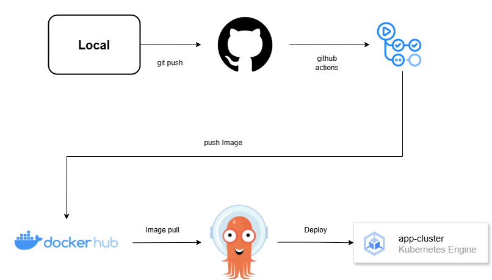

# Monitoring Project

## The Goal

- Locust로 부하테스트 실시
- HPA와 VPA를 사용하여 스케줄링
- Grafana로 시각화 및 분석

## Using Skill&Tool

### Monitoring

- Spring Boot:3.4.2
- Kubernetes:1.31.0
- Database
  - Local: MySQL
  - Test: PostgreSQL
- Prometheus
- Grafana
- Locust

### CI/CD

- GitHub Webhook
- Jenkins
- ArgoCD
- Docker
- Ansible

